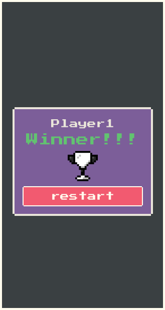

 <div align="center">
    
    
 </div>

 # **Matching Game**

 <div class="subtitulo" align="center">
    Este é o repositório do projeto <b>Matching Game</b>: desafio de programação voltado à Javascript puro como introdução aos estudos de React JS, criando um jogo de memória com ênfase do uso do Javascript para manipular a API do D.O.M e os arquivos css.
</div>

----------------------
 
## **Contatos e Links interessantes**
 <div align="center">
   <a href="mailto:pedro.viniciusacm@gmail.com" target="_blank"></a>
   <a href="https://wa.me/5581992874343" target="blank"></a>
   <a href="https://www.behance.net/pedrofelixg" target="_blank"></a>
   <a href="www.linkedin.com/in/pedrofelixgonçalves" target="_blank"></a>
   <a href="https://codepen.io/pedrofelixg-the-flexboxer" target="_blank"></a>
 </div>

 --------------------
## **Resumo do Projeto**
Todo projeto está baseado no plano de estudos do **Marco Bruno** voltado para um curso de Javascript para React. A playlist do desafio está disponível no YouTube: **[Curso de Javascript para React](https://youtube.com/playlist?list=PLirko8T4cEmzWZVn_ZKQbfDOuCnSZJ4va)**. O jogo da memória se baseia num plano do Figma, para 2 players alternado a partir do erro do outro oponente.<br>
A instalação do projeto é feita via **npm** e **[ViteJs](https://vitejs.dev/)**.<br>
Sequência de comandos:
```cmd
    > npm crete vite@latest matching-game-app
    > npm install

    "gera o local host para visualização e testes"
    > npm run dev
```
>Todos os commits que fiz do projeto passaram a atender a biblioteca de commit **[gitmoji](https://gitmoji.dev/)** para utilizar basta usar o comando **`$ npm i -g gitmoji-cli`** no terminal e aguardar o instalador dos pacotes. A documentação do uso dos commits está no site citado acima.

## **Descrição da Evolução do Projeto**
Como o foco do projeto está voltado para o Javascript e como utiliza-lo para fins de programação total do site, a biblioteca Vite.JS foi utilizada para criação do site e todo seu comportamento dinâmico.

## **Prévia do Jogo**



